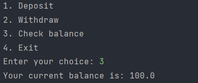
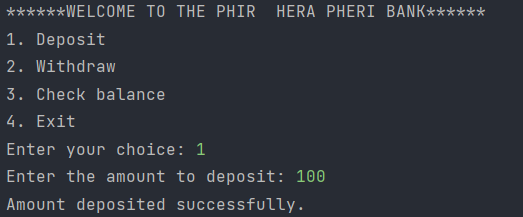

# _Bank_management

# Bank Management Program in Python by Piyush Solanki

This is a Python program that can be used for basic bank management. The program allows users to create accounts, deposit and withdraw funds, and check their account balance.

## Usage

To use the program, simply run the Python file `bank_management.py` and follow the prompts. The program will ask you to select an option from a menu and then provide further prompts depending on your selection.

## Features

The program includes the following features:

- Account creation: Users can create a new account by providing their name, address, and initial deposit amount.
- Deposit and withdrawal: Users can deposit or withdraw funds from their account.
- Balance check: Users can check their account balance at any time.
- Account details: Users can view their account details, including their account number, name, address, and balance.
- Account deletion: Users can delete their account if they no longer need it.

## Security

The program does not store any sensitive information such as account passwords, so it is safe to use.

## Author

This program was created by Piyush Solanki. You can contact me at jayantilalsolanki02@gmail.com if you have any questions or feedback.
